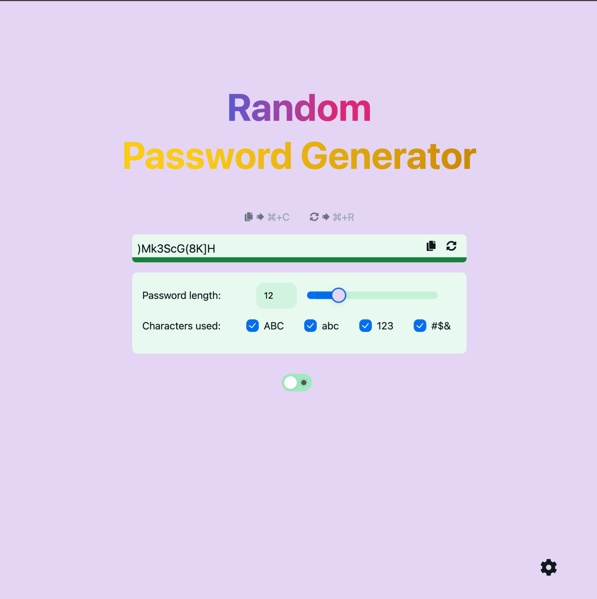
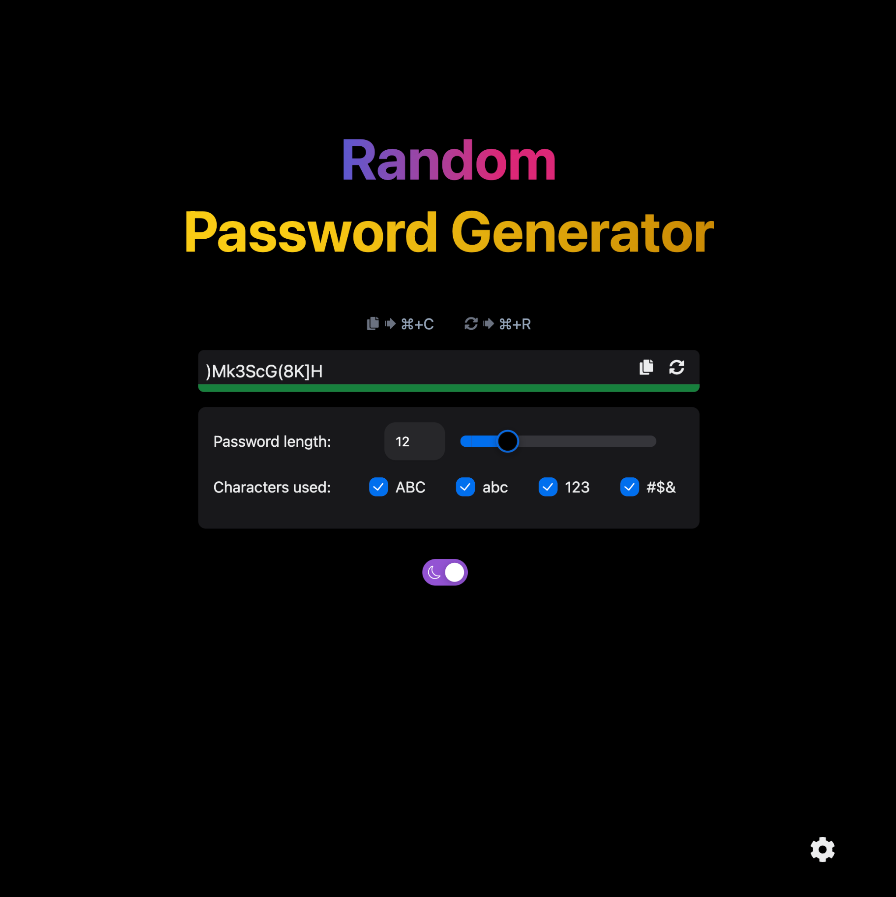

# Random Password Generator

## Overview

A Random Password Generator built using React, Next.js, NextUI, and TailwindCSS. This application allows users to generate strong, random passwords with customizable options for length and character types. It supports light and dark themes.

Demo Site: https://pwdgenn0nnn0.web.app/

## Table of Contents

- [Features](#features)
- [Screenshots](#screenshots)
  - [Light Mode](#light-mode)
  - [Dark Mode](#dark-mode)
- [Technologies Used](#technologies-used)
- [Getting Started](#getting-started)
  - [Prerequisites](#prerequisites)
  - [Installation](#installation)
  - [Running the Application](#running-the-application)
  - [Building for Production](#building-for-production)
- [Project Structure](#project-structure)
- [License](#license)
- [Contact](#contact)

## Features

- **Modern, Simple, and User-Friendly Design**: The interface is designed to be modern, simple, and easy to use.
- **Password Length**: Adjust the length of the password.
- **Character Types**: Include or exclude uppercase letters, lowercase letters, numbers, and special characters.
- **Theme Switcher**: Toggle between light and dark modes, with your preference being remembered for future visits.
- **Cookie Management**: Manage your cookie settings and preferences with ease.
- **Persistent Preferences**: Your theme choice and other settings are saved and remembered for your next visit.
- **Copy to Clipboard**: Easily copy the generated password.
- **Regenerate Password**: Quickly regenerate a new password with the same settings.
- **Keyboard Shortcuts**:
  - **MacOS**:
    - **Copy Password**: `⌘ + C`
    - **Regenerate Password**: `⌘ + R`
  - **Other Operating Systems**:
    - **Copy Password**: `Ctrl + C`
    - **Regenerate Password**: `Ctrl + R`

## Screenshots

### Light Mode


### Dark Mode


## Technologies Used

- [React](https://reactjs.org/)
- [Next.js](https://nextjs.org/)
- [NextUI](https://nextui.org/)
- [TailwindCSS](https://tailwindcss.com/)

## Getting Started

### Prerequisites

- Node.js (>= 12.0.0)
- npm or yarn

### Installation

1. Clone the repository:
    ```sh
    git clone https://github.com/FurkanDGN/password-generator.git
    ```
2. Navigate to the project directory:
    ```sh
    cd password-generator
    ```
3. Install the dependencies:
    ```sh
    npm install
    ```
    or
    ```sh
    yarn install
    ```

### Running the Application

1. Start the development server:
    ```sh
    npm run dev
    ```
    or
    ```sh
    yarn dev
    ```
2. Open your browser and go to `http://localhost:3000`

### Building for Production

1. Build the application for production:
    ```sh
    npm run build
    ```
    or
    ```sh
    yarn build
    ```
2. Start the production server:
    ```sh
    npm start
    ```
    or
    ```sh
    yarn start
    ```

## Project Structure

```plaintext
src
├── components
│   ├── CookieDialog.tsx
│   ├── CookieSettingsPopup.tsx
│   ├── CopyButton.tsx
│   ├── PasswordDisplay.tsx
│   ├── PasswordGenerator.tsx
│   ├── PasswordOptions.tsx
│   ├── RegenerateButton.tsx
│   └── SunIcon.js
├── pages
│   ├── _app.tsx
│   ├── _document.tsx
│   └── index.tsx
├── styles
│   └── globals.css
├── utils
│   ├── generatePassword.ts
│   └── passwordStrength.ts
public
├── robots.txt
└── favicon.ico
```

## License

This project is licensed under the MIT License. See the [LICENSE](LICENSE) file for details.

## Contact

- Author: [FurkanDGN](https://github.com/FurkanDGN)
- Email: furkandogan0@icloud.com

